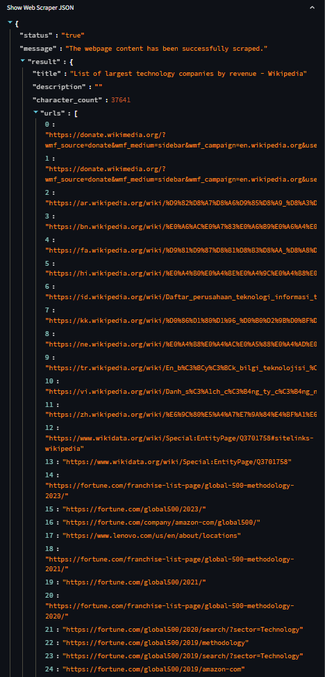
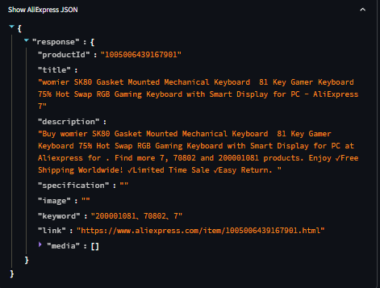
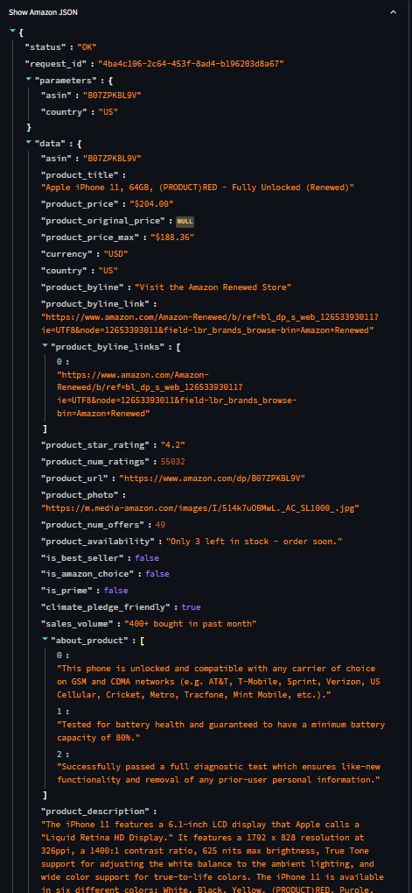

<<<<<<< HEAD
```markdown
# MarketPulse Tracker 🚀

MarketPulse Tracker is an interactive dashboard that aggregates real-time market data from multiple APIs, including a web scraper, AliExpress, and Amazon. This free version offers full access to real-time insights, and your support via Ko-fi is highly appreciated. ❤️
=======
# MarketPulse Tracker 🚀

MarketPulse Tracker is an interactive dashboard that aggregates real-time market data from multiple APIs, including a web scraper, AliExpress, and Amazon. The premium version provides exclusive insights for just $5. 💰
>>>>>>> 07cdbc2064c38ce176f9157c72fd1399596473cd

## Features ✨

- **Real-Time Data Integration:** Aggregates data from multiple APIs.
- **Interactive Dashboard:** Built with Streamlit for dynamic interaction.
- **Data Processing:** Cleans and combines data from different sources.
- **Ko-fi Support Integration:** Enjoy full free access and support the project via Ko-fi.
- **Future Enhancements:** Plans to add data export, custom analytics, and more features.

## Installation ⚙️

1. Clone the repository.
2. Create and activate a virtual environment.
3. Install dependencies:

   ```bash
   pip install -r requirements.txt
   ```

4. Create a `.env` file (refer to `.env.example`) with your credentials:

   ```ini
   RAPIDAPI_KEY=your_rapidapi_key_here
   SMTP_SERVER=smtp.gmail.com
   SMTP_PORT=587
   SMTP_USER=your_email@gmail.com
   SMTP_PASSWORD=your_app_password
   ```

## Running the Project ▶️

- **Data Collection:**  
  Run the main process with:

  ```bash
  python main.py
  ```

- **Interactive Dashboard:**  
  Launch the dashboard with:

  ```bash
  streamlit run dashboard/app.py
  ```

## Demo Results and Explanation 🔍

### A. Web Scraper

- **Tested Website:**  
  [Wikipedia: List of Largest Technology Companies by Revenue](https://en.wikipedia.org/wiki/List_of_largest_technology_companies_by_revenue)
- **Sample Result Image:**  
  

**Explanation:**  
<<<<<<< HEAD
The web scraper collects data from the provided URL (Wikipedia) and extracts key information, which is then displayed in JSON format and processed into a data table. 📊
=======
The web scraper gathers data from the provided URL (Wikipedia in this case) and extracts key information. The raw JSON data is available for inspection in the dashboard. 📊
>>>>>>> 07cdbc2064c38ce176f9157c72fd1399596473cd

### B. AliExpress

- **Tested Product:**  
  [AliExpress Product](https://www.aliexpress.com/item/1005006439167901.html)
- **Sample Result Image:**  
  

**Explanation:**  
<<<<<<< HEAD
The AliExpress API (using the `/product/description-light` endpoint) returns product details such as description, image, media, stock, and quantity. (Note: It does not return the price.) 🛒
=======
The AliExpress API returns product details such as description, image, media, stock, and quantity. (Note: The endpoint does not return price.) 🛒
>>>>>>> 07cdbc2064c38ce176f9157c72fd1399596473cd

### C. Amazon

- **Tested Product (Amazon):**  
  [Amazon Product Page (Example)](https://www.amazon.com/dp/B07ZPKBL9V)
- **Sample Result Image:**  
  

**Explanation:**  
<<<<<<< HEAD
The Amazon API extracts product details including price, which is processed to remove currency symbols and is used to generate a price comparison chart when available. 💵
=======
The Amazon API extracts product details including price. The price is processed to remove currency symbols and is used in the price comparison chart. 💵
>>>>>>> 07cdbc2064c38ce176f9157c72fd1399596473cd

## Service Offering on Freelance Platforms 💼

I offer a complete solution for developing and deploying an interactive MarketPulse Tracker Dashboard with real-time data integration using Python and RapidAPI. This service includes custom dashboard development, API integration, and data processing. The dashboard is provided free, and you can support the project via Ko-fi.

## License 📄

MIT License